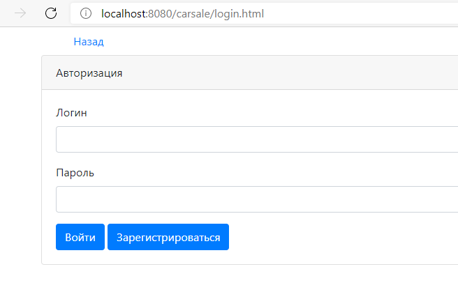
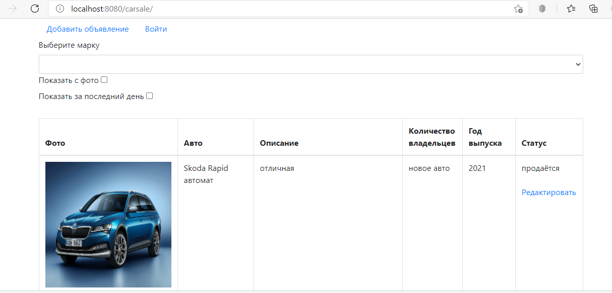
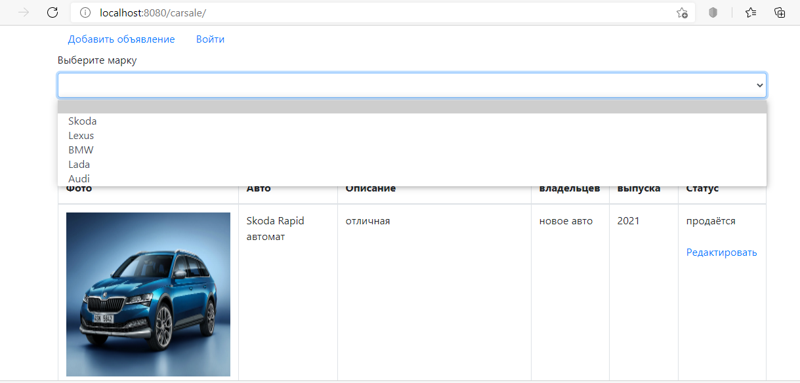
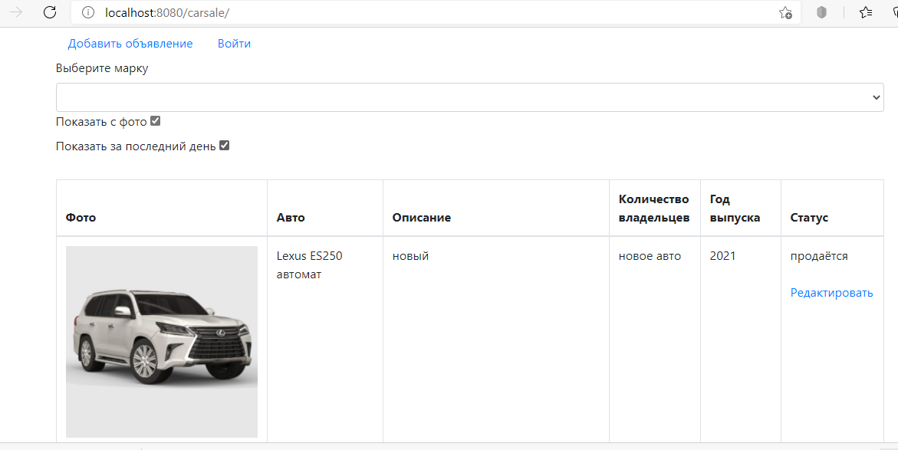
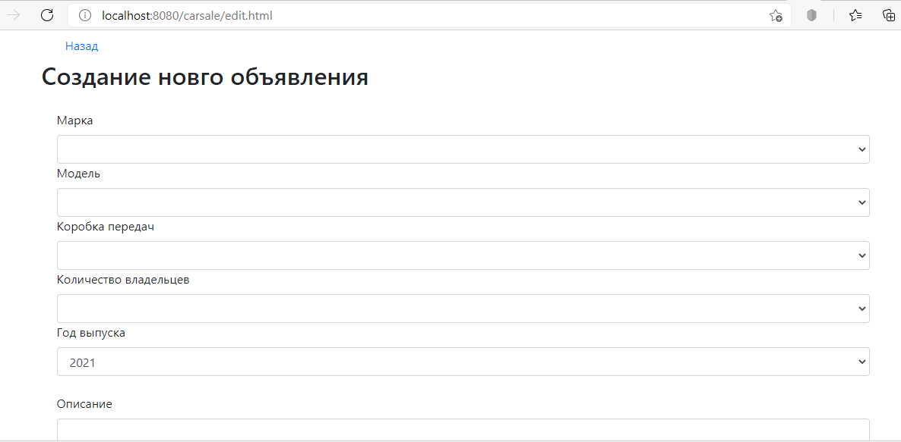
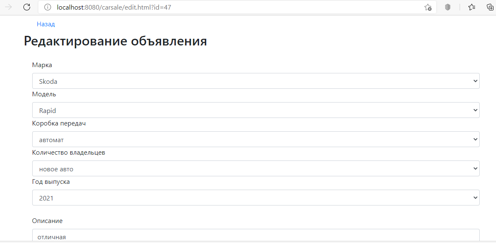
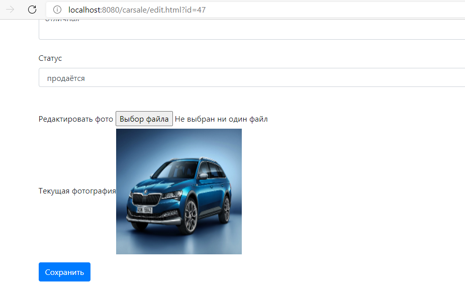

# job4j_carsale
### Description of the project.
This project represents the java web technology.This webapp using principle of MVC (model-view-controller). In that app representation example of place by sales cars. On the main page shows whole list of announcements. Log in to the app with a unique username and password. The user must register.  Also registered user available creation and delete announcements. All forms are validated. The ad text is generated automatically based on the completed form.  There are ad filters: everything, only with photos, ads for the last day and a filter by car brand.

### Used technologies
- Java EE
- MVC as design pattern.
- Servlet
- Slf4j for logging.
- Hibernate, DAO pattern
- PostgresSQL
- Front(jsp/jstl/js/HTML/bootstrap/CSS/ajax)
- Jackson for JSON building.
- Apache File Upload
- Tomcat Web server
- Maven as a build system
- CI/CD Travis
- Checkstyle
- Jacoco

### Functionality:
- Authentication.
- Registration.
- CRUD operations with Hibernate and PostgreSQL.
- Upload images.
- Add an advertisement for the sale of a car.
- Change the status of advertisement.
- Do filter ads.

### Steps of work
After you pushed webapp, you can use it. Steps of work are next:
1. Authorization page

2. The main page with all the ads.

3. On the main page there is a filter by criteria:
   Ads only with a specific car brand
   

4. Ads only with photos and for the last day

5. Page for adding a new ad

6. Ad editing page

7. Uploading a photo of the car

